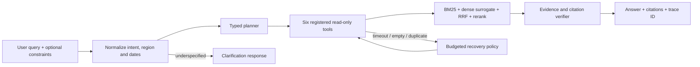

# Architecture and failure modes

## State machine

`receive -> normalize -> plan -> execute -> verify -> synthesize -> done`

Underspecified input exits through `clarify`. Unexpected failures exit through `failed` without accepting or executing user-provided DSL. Every completed request has a trace ID and data version.

## Trust boundaries

1. The request model accepts a question, region/date constraints, a 1–4 call budget, and an optional model-planning flag.
2. The planner can propose only six registered tools.
3. Pydantic rejects unknown fields before execution.
4. The Elasticsearch adapter constructs query clauses from an allowlist; it never accepts raw query JSON.
5. Discussion and official evidence retain different corpus labels through retrieval, citation, and response.
6. Citation synthesis only uses retrieved records. No evidence produces `insufficient_evidence`.

## Retrieval

The deterministic backend is a reproducible reference implementation:

- BM25 lexical ranking;
- signed feature hashing as a local dense surrogate;
- reciprocal-rank fusion;
- deterministic title/body/phrase reranking.

The signed hash vector is not represented as a trained semantic embedding. In an external run, the embedding adapter can be backed by `text-embedding-v4`, while the offline Elasticsearch mapping holds a 1,024-dimensional vector. The reranker interface supports a Model Studio endpoint and falls back locally on provider errors.

## Failure behavior

| Failure | Behavior |
|---|---|
| Unknown tool or extra argument | Reject before execution |
| Duplicate planned call | Drop using stable call signature |
| Tool timeout/backend error | Retry once inside remaining call budget |
| Filtered search returns empty | Retry once without optional filters, marking recovery |
| Model API invalid/unavailable | Deterministic planner/reranker fallback |
| Redis unavailable | Bounded in-memory TTL fallback |
| Elasticsearch unavailable | Local deidentified fixture fallback |
| No verified citations | Return `insufficient_evidence`, not a factual answer |

The API is currently single-process. Process-local traces and metrics are suitable for a demo, not durable audit storage. A production version would persist traces to an append-only store and use OpenTelemetry/Prometheus histograms.
