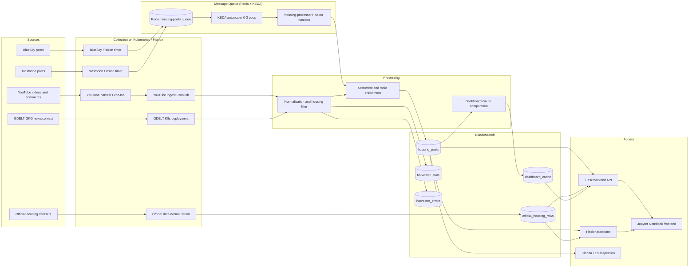

# COMP90024 Team 12 System Architecture

**Project:** How is housing insecurity discussed in Australian online communities?
**Team:** Team 12
**Cloud project:** `unimelb-comp90024-2026-12`
**Cluster:** `comp90024` on MRC / NeCTAR
**Updated:** 2026-05-19

This document is the submission-facing architecture summary. It consolidates the
runtime evidence provided by the deployment owner with the repository structure
used for the final submission. It intentionally avoids treating every runtime
experiment as a required source file; where a component is deployed or evidenced
through commands, the evidence is referenced rather than duplicated as raw logs.

## 1. Executive Summary

Team 12 built a cloud analytics pipeline for Australian housing-insecurity
discussion. The system collects online discussion and contextual news data,
normalises heterogeneous records, stores them in Elasticsearch, exposes analysis
through backend and Fission endpoints, and presents the result through a Jupyter
Notebook frontend.

At the 2026-05-19 verification checkpoint, the system had:

| Area | Verified status |
|------|-----------------|
| Online discussion index | `housing_posts`: ~1,727,000 documents |
| Official comparison index | `official_housing_rows`: 7,340,256 documents |
| Elasticsearch | green cluster, 2 nodes, 86/86 active shards |
| Fission | 5 functions, 3 timers, 4 HTTP routes, 1 MQ trigger verified |
| Kubernetes | backend replicas, GDELT workload, CronJobs, services and PVCs verified |
| Notebook output | final figures exported under `docs/` |

The total analytical store therefore contains over 9 million indexed records
across online discussion, news/contextual data and official comparison data.

## 2. Architecture Overview



## 3. Data Sources And Roles

| Source | Role in project | Collection style | Why it is included |
|--------|-----------------|------------------|--------------------|
| BlueSky | Public short-form housing discussion | Fission timer / incremental search | Captures informal and emerging public discussion |
| Mastodon | Federated community discussion | Fission timer / instance and hashtag search | Adds decentralised social context |
| GDELT GKG | News and contextual timeline signal | K8s deployment loop | Provides broader media and event context |
| YouTube | Video metadata and comment discussion | Dual CronJob pipeline | Adds long-form and comment-level discussion |
| Official data | Grounding and comparison | Offline/source normalisation into separate index | Prevents online discussion from being interpreted without context |

Official data is deliberately stored in a separate schema. It is used for
comparison and grounding, not merged directly into the social/news post schema.
This avoids implying that administrative records and public online discussion are
the same type of observation.

## 4. Collection Layer

### 4.1 BlueSky and Mastodon

BlueSky and Mastodon are short-running public API harvesters. The architecture
uses Fission timers for these because each run is lightweight and can be repeated
on a fixed schedule. Runtime evidence supplied by the deployment owner shows
30-minute timers for the social harvesters.

Design points:

- each run reads its previous cursor/state from Elasticsearch where available;
- source-specific APIs are wrapped before normalisation;
- Australian relevance is checked with query design and post-filtering;
- repeated collection is made idempotent through stable document identifiers;
- errors are captured in `harvester_errors` rather than silently dropped.

BlueSky and Mastodon harvesters publish raw posts to a Redis message queue
(`housing-posts`, `redis.redis.svc.cluster.local:6379`) via raw RESP protocol
socket writes. A dedicated Fission `housing-processor` function consumes the
queue, computes sentiment, and bulk-indexes normalised documents to
Elasticsearch. KEDA monitors the Redis queue depth through the `housing-mq`
ScaledObject and scales the processor from 0 to 3 pods based on message
volume. If Redis is unreachable, harvesters fall back to inline sentiment
computation with direct Elasticsearch indexing.

### 4.2 GDELT

GDELT uses a Kubernetes deployment rather than Fission because it is a
longer-running workload. It downloads and parses GKG files, applies Australian
and housing-related filters, and maintains checkpoint state.

Fission is intentionally not used for this part because backfills and repeated
file processing can exceed short function timeouts and require more persistent
state than a simple serverless invocation.

### 4.3 YouTube

YouTube uses a two-stage CronJob design:

1. `youtube-harvest` collects video and comment records into persistent storage.
2. `youtube-ingest` reads the master file, normalises records and bulk-indexes
   them into Elasticsearch.

This split reduces the risk that a harvest job is overwritten or interrupted
while ingestion is still pending. The verified data sync result at the final
checkpoint is 6,039 videos and 329,494 retained comments.

## 5. Processing Layer

The normalisation layer converts source-specific raw records into the searchable
`housing_posts` schema.

Common fields include:

| Field | Purpose |
|-------|---------|
| `doc_id` | Stable idempotent write key |
| `platform` / `source_type` | Source grouping and comparison |
| `source` | Author, instance, channel or domain |
| `title` / `text` | Searchable content fields |
| `created_at` | Publication time for trend analysis |
| `collected_at` | Pipeline collection time |
| `query_keyword` | Source query or hashtag provenance |
| `sentiment` / `sentiment_label` | Approximate tone signal |
| `housing_relevant` | Filter flag used by API and notebook queries |
| `raw_metadata` | Source-specific payload retained but not fully indexed |

The project uses a housing-domain lexicon and TextBlob-style polarity signal for
sentiment. The report treats this as an analytical approximation, not ground
truth. Housing relevance, location hints and sentiment are all heuristic labels
and must be interpreted cautiously.

## 6. Storage Layer

Elasticsearch is the main storage and query layer because the project needs both
full-text search and structured aggregation.

| Index | Role |
|-------|------|
| `housing_posts` | Main online discussion and news/context records |
| `official_housing_rows` | Official comparison data |
| `dashboard_cache` | Precomputed dashboard panels and expensive aggregations |
| `harvester_state` | Cursor/checkpoint state for incremental collection |
| `harvester_errors` | Operational error visibility |

Runtime evidence:

- Elasticsearch cluster health: green;
- two data nodes;
- all 86 shards active;
- replica count configured for redundancy across nodes;
- main indices populated with verified document counts.

## 7. API, Fission And Frontend

### 7.1 Backend API

The backend API keeps the notebook from embedding all Elasticsearch queries
directly. It exposes health, housing, official-data and analysis routes, making
the same analysis reusable from notebooks, demos and manual checks.

Main endpoint groups:

| Group | Purpose |
|-------|---------|
| `/api/health` | Backend and Elasticsearch health |
| `/api/housing/*` | Platform volume, timeseries, keyword and search views |
| `/api/official/*` | Official-data source, state, period and search views |
| `/api/analysis/*` | Sentiment, city/region, keyword and word-cloud views |
| `/api/cache/*` | Cached dashboard summaries |

### 7.2 Fission

Fission demonstrates the serverless requirement. It is used for lightweight
functions, timers and integration checks. The architecture deliberately does not
force every workload into Fission; GDELT and YouTube batch-style work remain in
Kubernetes deployments or CronJobs.

Verified Fission evidence in the report includes social harvest functions,
dashboard computation and a health function/timer setup.

### 7.3 Jupyter Notebook Frontend

The notebook frontend presents:

- dataset overview;
- source/platform summary;
- keyword and topic analysis;
- sentiment comparison;
- time and regional views;
- official-data comparison.

Final exported notebook figures are stored in `docs/figures/report/*.png` and are referenced by
the report and presentation materials.

## 8. Infrastructure Topology

The final deployment uses a Magnum-created Kubernetes cluster named
`comp90024` with 4 nodes (1 control-plane, 3 workers). The cluster is accessed
through `config.12.yaml` for submission and through `kubectl` during demo
verification.

All inter-service communication occurs over the Kubernetes internal network
(CIDR `192.168.10.0/24`) via ClusterIP DNS names. External access is provided
through two paths: the K8s API server on the cluster floating IP (authenticated
via kubeconfig), and the Flask backend on NodePort `30080`. In development and
demo contexts, `kubectl port-forward` tunnels Elasticsearch, Kibana, and the
Fission router to localhost.

Important demo commands:

```bash
kubectl get nodes -o wide
kubectl get pods -A
kubectl get pvc -A
kubectl get svc -A
kubectl get hpa -A
fission function list
fission timer list
```

Local access is normally through port-forwarding:

```bash
kubectl port-forward service/elasticsearch-es-http -n elastic 9200:9200
kubectl port-forward service/kibana-kb-http -n elastic 5601:5601
kubectl port-forward service/router -n fission 9090:80
```

The full set of teammate-supplied command checks and screenshots is summarised
in `docs/runtime_evidence.md`, with extracted images under
`docs/evidence/screenshots/`.

## 9. Error Handling And Fault Tolerance

| Risk | Mitigation |
|------|------------|
| API rate limits | query rotation, scheduled runs and retry windows |
| Partial ingestion | stable `doc_id` and Elasticsearch upsert behaviour |
| Harvester crash | state checkpointing in `harvester_state` |
| Silent failures | error records written to `harvester_errors` |
| Elasticsearch node failure | replica configuration on a two-node cluster |
| Backend pod failure | multiple replicas, probes and HPA manifest |
| Heavy workload timeout | GDELT/YouTube use K8s workloads instead of Fission |
| Notebook dependency on cluster | notebook can use API/ES or exported result figures for demonstration |

The repository includes a GitLab CI/CD pipeline (`.gitlab-ci.yml`) with three
stages: `lint` (syntax-checks all Python files), `test` (sentiment and
normalisation unit tests), and `deploy` (manual, applies K8s manifests and
updates Fission functions). The lint and test stages run on every push; the
deploy stage requires `KUBECONFIG_B64` and a live cluster.

## 10. Verification Summary

The 2026-05-19 verification package records:

| Check | Result |
|-------|--------|
| Kubernetes nodes and pods | Verified by command screenshots |
| PVC, services and HPA | Verified by command screenshots |
| Elasticsearch health and indices | Verified by command screenshots and report appendix |
| Fission functions and timers | Verified by command screenshots and report appendix |
| YouTube CronJobs and dashboard cache | Verified by command screenshots |
| GDELT logs and harvester state | Verified by command screenshots |
| Backend API checks | Verified through in-pod API command |
| Harvester state/error indices | Verified through Elasticsearch queries |

The formal report remains the canonical narrative. This architecture document is
the concise technical map that explains how the components fit together.

## 11. Repository Map

| Path | Purpose |
|------|---------|
| `backend/api/` | Flask API route groups |
| `backend/analytics/` | Elasticsearch client, normalisation, sentiment and query helpers |
| `backend/deployment/k8s/` | Kubernetes namespace, deployment, service and HPA manifests |
| `backend/deployment/fission/` | Fission deployment script and function code present in the repository |
| `backend/mappings/` | Elasticsearch index mappings |
| `database/` | Canonical database/index mapping support |
| `frontend/` | Jupyter Notebook dashboard |
| `docs/final_report.md` | Canonical report source |
| `docs/runtime_evidence.md` | Command evidence summary extracted from teammate material |
| `docs/evidence/screenshots/` | Runtime command screenshots extracted from the teammate Word document |

## 12. Design Trade-Offs

1. **Kubernetes vs Fission.** Kubernetes is used for long-running or stateful
   workloads; Fission is used for lightweight timer/function demonstrations.
2. **Elasticsearch vs flat files.** Elasticsearch provides full-text search,
   aggregations and dashboard-friendly queries; flat files are retained only as
   raw or intermediate data.
3. **Official data separation.** Official datasets remain in
   `official_housing_rows` rather than being forced into `housing_posts`.
4. **Notebook as frontend.** The notebook is the final user-facing interface
   because the assignment emphasises notebook-based analysis and demonstration.
5. **Heuristic analytics.** Sentiment, region and relevance labels support
   large-scale exploration but are not treated as perfect truth.
