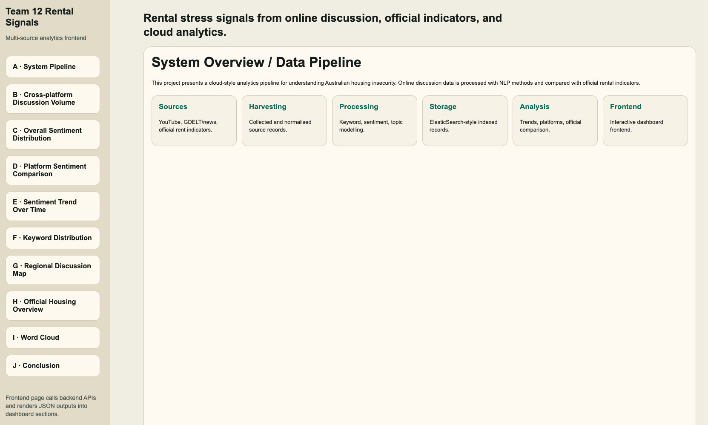
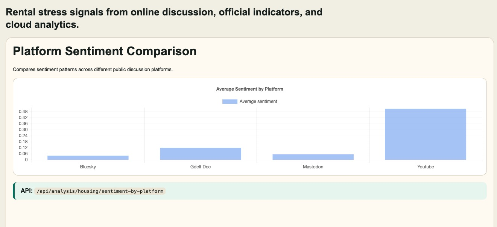
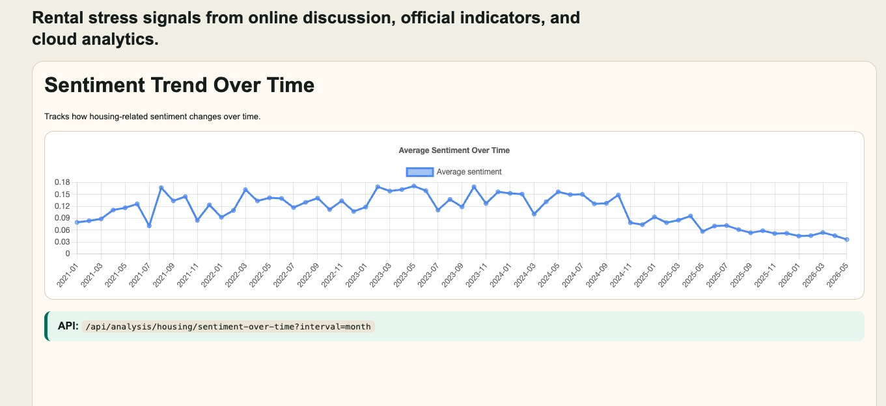
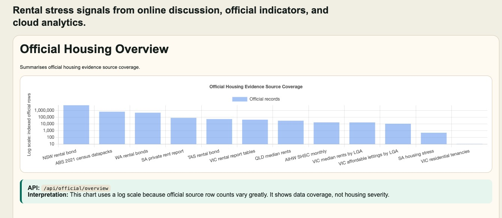

# How is housing insecurity discussed in Australian online communities?

**COMP90024 Cluster and Cloud Computing --- Assignment 2 Final Report**

**Attribution:** COMP90024 Team 12 (member identities removed from this public portfolio copy).
**Repository:** https://gitlab.unimelb.edu.au/comp90024_team_12/comp90024_team_12
**Demo:** https://www.youtube.com/watch?v=vw-pIS9rfAk

## Executive Summary

This project investigates how housing insecurity is framed within Australian online communities. Team 12 built a cloud-based analytics pipeline that gathers online discussion and official contextual data, normalizing heterogeneous source records from various sources, then stores them within Elasticsearch. Backend REST APIs and Fission functions provide analytical capabilities, and exhibit the results via a Jupyter Notebook frontend.

The project is rooted in the visible housing stress within Australia. There is public concern in both online spaces and news outlets regarding the rental affordability, security of home, shared housing, insecure tenancies, property inspections,rental bonds, behaviour of landlords and agents, eviction risks which leads to homelessness. These conversations do not directly measure the actual prevalence of housing insecurity, instead, they provide valuable signals such as public attention, linguistic framework, emotional tone as well as platform-specific discourse patterns.

The system integrates community-oriented data sources including BlueSky, Mastodon, GDELT, and supplementary YouTube contents. Official housing datasets maintained separately for further comparative analysis. Such separation is essential as official datasets and online discussions are generated in diverse channels, as the project prevents the assimilation of official data rows and the social posts as the same type of evidence.

The pipeline is applied at MRC/NeCTAR infrastructure and the Kubernetes cluster: comp90024, using Kubernetes manifests, Dockerised backend components, Elasticsearch mappings, Fission functions and scheduled timers, data harvesting and normalisation code, RESTful backend endpoints and a notebook-based frontend. As the data shown at the checkpoint at 18 May 2026, the Elasticsearch instance contained approximately 1.71 million housing related posts and 7.34 million official_housing_rows records. The online datasets includes the content from BlueSky, GDELT, Mastodon, YouTube, with 328,918 relevant comments retained via the YouTube raw/PVC pipeline. Additionally, runtime validations confirmed the availability and stability of Kubernetes resources, Elasticsearch health, Fission functions and scheduled timers, backend API routes, persistent volumes, and notebook cache panels.

## 1. Introduction and Scenario

Homelessness is a significant social and economic problem in Australia. It can be measured by official indicators like levels of rent, housing stress, homelessness service demand, bond data, vacancy rates, and census related measures. Those indicators, however, don't fully reflect the ways in which people talk about housing issues on public online platforms. One way that this can be observed is through online discussion where the language people use, the topics that have been highlighted and the emotional context of housing insecurity can be seen.

This project asks:

**How is housing insecurity discussed in Australian online communities, and how do online discussion patterns relate to official housing-related indicators?**

The scope is designed to be practical and assignment based. The system does not make inferences about private demographic characteristics nor does it identify persons or suggest that it is measuring all housing insecurity in Australia. It examines public or gathered text records and pose the question: Is it possible to collect, index, analyse and present a housing-insecurity conversation at the scale that is appropriate for COMP90024 Assignment 2, by using a cloud-based data system?

The themes of the project are the following: rent, rental stress, rent increases, trouble finding housing, shared housing, issues with landlords, issues with real estate agents, inspections, lease/bond, risk of eviction and discussion of the housing crisis generally. The case study meets the assignment requirements as it is located in Australia, has external data which is large scale, has supporting official data and has the advantages of cloud search and aggregation.

The real world scenario also has a well-stated user story. The user of the final notebook should be able to open it, see the project context, see the amount of housing-related discussion they have gathered, compare platforms, see sentiment and topic patterns and then, relate them to official housing indicators. The system thus does not conform to a crawler-only project and is not a report-only project. It brings together collection, storage, API access, analytics and explanation in a single workflow. This is relevant to the assignment as the technical stack is assessed via a working cloud-based application and the report should be used to explain what the application is trying to solve.

The project also gives the term ‘community' a wide definition. BlueSky and Mastodon offer social-media style discussion, YouTube offers a source oriented around discussion of housing-related content in video, and GDELT offers public media context oriented with and for comparison to social discussion. This mix provides a wider perspective than any one platform and the report refrains from claiming that it is a full picture of Australian society. The analysis is best thought of as a "structured sample," of public online signals of housing insecurity.

The project is informed by four research questions:

1. **What housing-insecurity topics appear most often in online discussion?** This includes terms around rent, eviction, inspections, bonds, leases, share housing, homelessness, landlords, and housing crisis language.
2. **How does discussion vary across platforms and sources?** BlueSky, Mastodon, GDELT, and YouTube differ in format, audience, and visibility. The project therefore treats platform as an important analytical dimension.
3. **What sentiment or emotional tone appears in housing-related discussion?** Sentiment analysis is used as an approximate signal of positive, neutral, or negative framing, not as a definitive emotional measurement.
4. **How do online discussion patterns compare with official housing-related data?** Official data is used as comparative context rather than as the same type of record as online discussion.

These questions are purposefully written as discussion and system questions, not causal questions. For instance, the project does not attempt to show that views expressed online lead to rent changes, nor that one site is the entire Australian housing debate. Rather, it asks whether some cloud analytics system can integrate large public discussions, official context and reproducible notebook outputs so as to facilitate inspection of the public discussion. This is the framing that is crucial for not overclaiming. It also aligns with the technical objective of the assignment: the significance of the project is established by the operational distributed pipeline and the defensible interpretation, and not just one final chart.

The final report therefore uses a “system plus findings” structure. Earlier sections explain the data sources, cloud architecture, storage model, and deployment choices. Later sections explain the notebook analytics and what the results show. This structure makes the report longer than a short data-science memo, but it is appropriate for an assignment where the technical implementation is part of the assessed outcome. The report keeps a limited number of figures and uses text to explain the rest of the evidence so that the page count is driven mainly by analysis rather than by large screenshots.

## 2. Assignment Requirement Coverage

Assignment 2 is a cloud based big data analytics project that needs to be implemented using the technologies presented in the workshops, such as MRC/NeCTAR Research Cloud, Kubernetes, Docker, Fission and Elasticsearch. It also requires access to data and a Jupyter Notebook front end, use of official data, analytics/visualisation, a demo video and a report to discuss architecture and platform choices. The following are the components of Team 12 addressing the above requirements.

| Requirement area | Team 12 response | Repository evidence / implementation evidence |
| --- | --- | --- |
| Australian scenario | Housing insecurity in Australian online communities | Defined in this report and README |
| External/community data | BlueSky, Mastodon, GDELT, supplementary YouTube | data/, backend/harvesting/, backend/analytics/normalisation/ |
| Official-data scenario | Separate official-data schema and comparison workflow | data/official_sources/, backend/mappings/official_housing_rows_mapping.json |
| Kubernetes | MRC/Magnum cluster and K8s manifests | backend/deployment/k8s/, verified cluster comp90024 |
| Docker | Containerised backend deployment | backend/Dockerfile |
| Elasticsearch | Storage, search, text indexing, and aggregations | backend/mappings/, database/, verified ES indices |
| Fission | Serverless functions, scheduled timers, MQ trigger, and KEDA-driven event processing | backend/deployment/fission/ |
| Jupyter Notebook frontend | Notebook dashboard used as client/front-end interface | frontend/housing_api_dashboard.ipynb |
| RESTful backend | CORS-enabled API exposes data to the notebook through cross-origin endpoints | backend/api/, all responses include Access-Control-Allow-Origin: * |
| Dynamic scaling | K8s/HPA and modular harvester/function design | backend/deployment/k8s/04-backend-hpa.yaml |
| Error handling | Logging, retries, idempotent ingestion, PVC persistence, API fallback behaviour | Backend/deployment code; summarised in Section 11 |
| Video demo | Final video demonstrates core functionality | Link to be added after upload |
| Source code | GitLab repository following assignment naming | Repository link above |

This report also details the team roles, design decisions, scenarios supported, outcomes, advantages and disadvantages of using cloud, and limitations. In order to prevent developing an unnecessarily long structure, detailed implementation evidence is woven into the sections that it applies to instead of placing detail in numerous small subsections.

Another condition is that the app should be more than a bunch of unrelated scripts. In our implementation, all the above are linked together in one scenario, including the notebook, APIs, Elasticsearch indices, Kubernetes resources and the Fission functions. The notebook is the user-facing interface; the access layer is the backend API; the search and aggregation store is elasticsearch; the runtime environment is Kubernetes; and Fission supports selected function-like tasks. This alignment is helpful for assessment because every component plays a part in the final workflow and isn't just a checklist that you need to check off.

The requirement coverage table is also used as a consistency check for the final submission. Each of the major technical requirements must be mentioned at three points: repository, report and video/demo. For instance, Kubernetes is not only referred to in the architecture story but manifests and verification commands are used to represent it. Elasticsearch is not solely used as a database, it's also used in mappings, document storage, counts of sources, aggregations and the backend query responses. Fission is not a generic cloud buzzword, but a framework for executing selected lightweight functions and timers in a server-less manner. This minimises the potential for the report to over represent the system that has been implemented.

Careful interpretation of some requirements. The assignment promotes stream data processing and ingestion via Fission, and our final implementation will be like that, but not pushing all of our jobs into Fission. Heavy backfills and long-running workloads as Kubernetes workloads, and functions level execution for Fission. The notebooks are likewise not an afterthought, but the front end. It's the user interface that facilitates the interpretation, query and presentation of analysis.

## 3. Team Roles and Process

Team 12 based the project on a system of modules and pipelines. This allowed for parallel processing and, at the same time, integration into a final system.

| Role label | Main responsibility | Contribution summary |
| --- | --- | --- |
| A | Project coordination, integration, report and presentation | Coordinated scope, meetings, final packaging, report integration, presentation structure, and requirement alignment |
| B | Data collection, cloud deployment and backend integration | Supported harvesting, Kubernetes/Fission deployment, Elasticsearch verification, backend runtime checks, and implementation evidence |
| C | Cluster deployment and storage support | Supported Kubernetes configuration, Elasticsearch storage/deployment logic, deployment documentation, and team integration feedback |
| D | Analytics and result interpretation | Sentiment analysis, regional/time/source analysis, topic/keyword analysis, and official-data comparison support |
| E | Frontend and demo | Jupyter Notebook interface, visualisation layout, demo flow, frontend checking, and presentation support |

The team had many decisions to make during the project regarding the scope of the work. The key decision was to focus on a stable end-to-end system, rather than introducing additional sources late on the time line. The team also ensured that official data were not mixed up with online discussion data which made the interpretation more defendable.

One of the key challenges for this project was the coordination of the different activities involved, as the project involved cloud deployment, data collection, data analytics, data visualisation and report writing. Some problems occurred with scheduling deployment, lack of full documentation of Kubernetes, and the lack of consistency in the output of analytics and presentation on the front end. These were managed with follow up meetings, better task ownership and final verification checkpoints. The last step was to ensure that the system outlined in the report, video, notebook and repository is the same system.

The second practical problem was a role overlap. Changes to backend code, backend APIs, and analytics results each have an impact on the final video narrative, which is impacted by deployment decisions. Therefore, the final integration took on the nature of a shared activity and not five individual submissions. The team came up with a list of action items and meeting notes to ensure items were completed prior to video recording, including cloud deployment, check of the frontend, documentation of Kubernetes, team feedback forms and report/slides consistency. This report follows suit by referring to the system as one pipeline rather than as separate member outputs.

The final contribution descriptions are designed to be brief. They recognize the different areas of responsibility, but not that no single person came into contact with a component. In practice, for example, the deployment evidence and the screenshots in the front end were also reviewed by more than one member in the final packaging phase, together with the language in the report.

## 4. Data Sources and Labelling Strategy

The system utilizes more than a single on-line or community-based source:

- **BlueSky:** public social discussion records with text and post metadata.
- **Mastodon:** federated social discussion records, including posts associated with Australian instances or location terms.
- **GDELT:** news and contextual records useful for public media attention and timeline analysis.
- **YouTube:** supplementary video and comment material related to Australian housing discussion.

Multiple sourcing means not presenting a single-platform perspective on housing discussion. The sources are however, diverse. A BlueSky post is not a Mastodon status, an article on GDELT is not a YouTube video/comment and so on. The normalisation layer maps the fields of the sources into a common analytical schema, keeping some raw metadata.

The 2026-05-18 live-cluster verification final data counts are:

| Source | Platform / index role | Verified records | Notes |
| --- | --- | --- | --- |
| BlueSky | housing_posts.platform = bluesky | 761,240 documents | Social-media posts |
| GDELT GKG | housing_posts.platform = gdelt_doc | 715,486 documents | News/contextual records |
| Mastodon | housing_posts.platform = mastodon | 233,239 documents | Federated social posts |
| YouTube | housing_posts.platform = youtube | 6,002 video documents | Video-level ES records |
| YouTube comments | raw/PVC and video metadata | 328,918 comments | Supplementary discussion evidence, not counted as separate housing_posts documents |
| Official housing data | official_housing_rows | 7,340,256 documents | Separate official-data index |

The live housing_posts count was slightly different when it was finalized as the harvesters were still running. In the report, the authors have therefore made use of approximate totals where exact counts are not necessary.

Official data was obtained from ABS (2021 Census DataPacks), AIHW (Specialist Homelessness Services Collection), and NSW Government (Rental Bond lodgement and refunds data). All sources were normalised into the `official_housing_rows` index, with a schema separate from the online discussion data.

The main filtering issue is housing relevance. Very general online collection strategies can result in the collection of data that is not relevant, and very specific strategies can result in the failure to collect data that is relevant. So team 12 is based on an explainable vocabulary and a rule based relevance approach. Housing related words are rent, rental, renter, tenant, housing stress, rental stress, landlord, agent, property manager, lease, inspection, bond, eviction, homelessness, social housing, public housing, share house, housemate, accommodation and housing crisis.

Australia relevance is achieved by source choice, region terms, city/state references or platform specific constraints. It's not about absolute geolocation. The objective is to enhance the chances of discussed analysis to be related to Australia. The field housing_relevant has been normalised, so that dashboards and API routes can use it to filter relevant records without having to do the expensive text matching in each query. There are still limitations: non-important keywords can be used in the indirect language, sarcasm is hard to classify, the words related to housing can be used in a non-housing context, and the geographical information can be missing or ambiguous.

There was varying filtering logic needed for each platform. Keyword queries and post-text filtering: blueSky is based on keyword queries and post-text filtering; the primary problem is obtaining a balance of recall and precision. Mastodon supports hashtags in posts, location hints on instances and location terms in Australia where they are present, and the federated nature of Mastodon makes coverage uneven, but brings diversity. GDELT offers structured news/context records; it offers the greatest value for its public media context and broad time series coverage and the greatest difficulty is in filtering enough records without having to run out of memory. YouTube has a hierarchical content and query filtering system and the video record is stored in Elasticsearch, the comment record is kept by the raw/PVC pipeline. This is a platform specific design and more reliable than trying to shoehorn all the sources into one collection method.

The official-data component is especially crucial for the assignment in that it shows that the project is not solely social media driven. Official data offers a more stable backdrop or context on which to judge the volume of online attention. For instance, if there is an increase in online discussion on rent pressure in a specific time frame, official rent or housing indicators can be used for background context. The project does not, however, make the assumption that there is a cause-and-effect relationship in this comparison. Media attention, collection timing, policy announcements or platform activity can lead to a spike in discussion, unrelated to a change in housing conditions.

The labelling strategy will be audit friendly. It would be possible to enhance recall by using a machine-learning classifier but this would also complicate explainability and validation aspects that are hard to achieve reliably in the assignment scope and timeline. The rule based relevance method is easier to use, but it has the benefit that reviewers can review the terms and see how and why a record is in. This is suitable for a cloud analytics assignment and the primary focus is to create and validate a functioning end-to-end system.

Handling of the YouTube data was a bit special. The structures of video-level metadata and of material at the comment-level differ. If the comments were not put in normalised housing_posts documents, then there would be more data indexed than is reported here. The report thus identifies the 6,002 video-level Elasticsearch documents and the 328,918 comments that they are associated with and that are kept in raw/PVC metadata. This separation is maintained throughout the report to avoid the technical overclaiming.

The data strategy also accounts for the different use of the sources in the final analysis. BlueSky and Mastodon are more towards a direct social discussion that is short-form, GDELT offers more broad media discussion context, while YouTube brings together video metadata and comment material. Official data is structured and institutional, not conversational, and is different again. Though more simply interpreted by viewing these sources as equivalent, this would dilute the strength of the interpretation. The project thus only standardises the fields that are necessary for the ability to query across sources, but retains the source labels and raw metadata for traceability purposes.

This is a crucial option for Elasticsearch. It helps to have a shared search index only if the shared fields have similar meanings. Normalised schema is suitable for fields like source, created_at, text, and housing_relevant. If one is looking for official indicators – like measure name, unit, geography, reporting period, etc. – then a separate index is more defendable. Consider the official rows and the posts on the internet as context on where and when housing pressure is recognisable in structured data and as the subject of public and media discussion.

## 5. System Architecture

The overall pipeline is:

```text
Sources of data – Harvesting / collection – Cleaning and normalisation – Enrichment (sentiment, topic, location) – Elasticsearch ingestion – Backend API and Fission functions – Analytics queries – Jupyter Notebook frontend.
```



The BlueSky and Mastodon harvesters follow an event-driven message queue path. Each harvester publishes raw posts to a Redis queue (`housing-posts`, `redis.redis.svc.cluster.local:6379`) via raw RESP protocol socket writes. A dedicated Fission `housing-processor` function consumes the queue, computes sentiment via the unified domain lexicon with TextBlob blending (35% TextBlob / 65% domain), and bulk-indexes normalised documents to Elasticsearch. KEDA (Kubernetes Event-Driven Autoscaling) monitors the Redis queue depth through the `housing-mq` ScaledObject and scales the processor from 0 to 3 pods based on message volume. If Redis is unreachable, harvesters detect the connection failure and fall back to inline sentiment computation with direct Elasticsearch indexing — no data is lost. This design decouples collection from processing: harvesters focus on acquisition, while the processor handles sentiment and normalisation independently. GDELT is a stateful K8s Deployment unsuitable for Fission's stateless model, and YouTube is a batch CronJob; neither is placed on the MQ path. Official data is normalised and bulk-indexed into `official_housing_rows` through a separate batch pipeline, then queried via `/api/official/*` endpoints for comparison with online discussion.

All inter-service communication occurs over the Kubernetes internal network (CIDR `192.168.10.0/24`) via ClusterIP DNS names of the form `<service>.<namespace>.svc.cluster.local`. External access is provided through two controlled paths: the K8s API server on the cluster floating IP (authenticated via kubeconfig), and the Flask backend exposed on NodePort `30080` for API access. In development and demo contexts, `kubectl port-forward` tunnels Elasticsearch (`:9200`), Kibana (`:5601`), and the Fission router (`:9090`) to localhost. No service other than the K8s API and the NodePort backend is directly reachable from outside the cluster.

There are five principles of the architecture. Firstly, there is separation between raw collection and normalisation. The harvesters have to be given some source records and normalisation can be developed over time without re-writing all the harvesters. This is crucial, since platform schemas are different, and can change over time. Second, online discussion and official data are kept in separate indices, which means that the online discussion with the official data are not mixed up as if they are the same. Third, Elasticsearch is the primary searchable analytics store since the project is text-based and user's needs include full text search, keyword aggregation, date filtering, and dashboard-style queries. Fourth, Kubernetes will be for the cloud environment for long running services, Fission will be used for lightweight functions, timers and integration checks. Fifth, the Jupyter Notebook is a front-end and the ultimate analytical narrative that incorporates queries, charts, markdown explanation and demo outputs.

The ingestion pipeline has source-specific collection and shared normalisation/indexing stages:

```text
Collect raw records-&gt; store raw snapshots or PVC files wherever necessary-&gt; clean and normalise fields-&gt; set the housing relevance and source labels if available-&gt; upsert into Elasticsearch-&gt; query through the backend APIs and notebook charts.
```

This design can be made to accommodate idempotent ingestion: the ingestion should update existing records without duplication if it's rerun. The implementation is based on the difference between video-level Elasticsearch documents and the comments in raw/PVC metadata. This helps to not over-claim that each comment is its own housing_posts document.

RESTful routes are exposed on the backend that are called by the notebook and integration checks. With the API layer, the frontend can have a uniform interface over elasticsearch and doesn't have to put a complex elasticsearch query everywhere. These endpoint types include overview statistics, source distribution, timeline aggregation, sentiment distribution, regional distribution, keyword/topic analysis, official data queries and special analysis for YouTube. This design also renders the notebook extra stable: If a query changes, the backend can get updated but the notebook interface can stay the same.

This architecture is supported by the repository structure. The backend area includes API, deployment, harvesting, analytics, mapping and integration code. The notebook interface is on the front end part. The database and mapping files contain evidence for Elasticsearch schema/query. The docs area is for architecture, planning, report and deployment information. The separation allows the marker to easily find the evidence needed for the assignment: cloud deployment resources are not embedded in notebook cells, and analysis code is not embedded in the report.

A maintainability boundary is also the backend/API layer. This keeps the notebook from being a set of raw Elasticsearch commands. Rather, it can ask for general panels like overview, timeline, cities, keywords, official data and YouTube results. This makes the demo easier to understand, and minimizes the risk of the presentation in the front end being impacted by minor changes in the Elasticsearch query.

You can also develop the architecture incrementally by various team members. One member may enhance the harvester or normaliser without involving a change in the notebook layout. Another member can tweak an API endpoint without having to modify any of the data collection code. A third member can develop the notebook explanation with the aid of fixed cached response. This division was beneficial during the last phase as deployment, report writing, video preparation and checking of notebooks needed to occur simultaneously. The design is thus not merely technical drawing; it is also a drawing of the management of the working team in the project, with regard to its assignment.

The system is not claimed to be a production grade monitoring system. It's a course project that shows the important cloud-computing concepts at a real size. However, all of the same design rules would be followed with a bigger implementation; raw data should be separated from cleaned data, provenance data should be stored, APIs should be stable, official data should be separated from social discussion and deployed services should be tested with commands that can be repeated and not solely with screenshots.

## 6. Cloud Infrastructure and Deployment

The desired cloud platform is MRC/NeCTAR Research Cloud. The name of the Kubernetes cluster is:

```text
comp90024
```

The validated cluster configuration is:

```text
4 nodes: 1 control-plane and 3 worker nodes
```

Pods observed during verification: Worker 1 was running Fission core services (builder, executor, timer), Kibana, and the compute-dashboard Fission function. Worker 2 hosted one housing-backend replica, Elasticsearch data node 0, and poolmgr pods. Worker 3 hosted the second housing-backend replica (with podAntiAffinity), the GDELT gdelt-gkg-harvest deployment, Elasticsearch data node 1, and the Fission router. Redis and CronJob pods were dynamically scheduled across available workers.

The final verification kubeconfig must follow the necessary naming convention:

```text
config.12.yaml
```

The backend API, the services related to Elasticsearch, the components of Fission, the persistent volumes, the scheduled workloads, and the deployment resources are all hosted on Kubernetes. All repository evidence can be found in the backend/deployment/k8s/ and backend/deployment/README.md files. Verification commands include:

```text
kubectl get nodes
kubectl get pods -A
kubectl get svc -A
```

Backends support is done with backend/Dockerfile, the reproducible backend container image. As a pragmatic move, in the current deployment, the backend is packaged as a ConfigMap (backend.tar.gz) and deployed using a kubectl apply rather than a container registry, in order to have a stable pipeline during assignment time. The Dockerfile would be part of the CI/CD pipeline for automated image building and deployment for a production system.

The main storage and analytics layer is Elasticsearch. It offers full-text search, keyword aggregation, date aggregation, source level filtering and sentiment/topic queries. Kibana is primarily for inspection and debugging, and not as the end-user facing UI. The main indices include housing_posts (normalised online/news discussion data), official_housing_rows (official housing data), and runtime/cache indices (selected backend and dashboard workflows).

Selective use of fission. Fission is good for light-weight serverless jobs, scheduled timers, function-level checks, and small integration workflows, but for long-running or resource-heavy jobs, consider using Kubernetes Deployments or Jobs. This is to prevent Fission from being seen only as the execution layer, and it is a better representation of how it is deployed.

The system has three ways of providing for dynamic growth. Kubernetes (at the infrastructure level) scales backend services (housing-backend-api-hpa: min 2, max 5 replicas, target CPU 70%). At the event driven level, KEDA monitors the Redis housing-posts queue and scales the housing-processor from 0 to 3 pods depending on how many messages are on the queue, starting from zero when idle and bursting to 3 under load. Collection, normalisation and indexing are modular at the application level allowing the addition of new source-specific harvesters. Adding a new platform shouldn't require re-writing the notebook or even the whole backend (as long as the new source can be mappable to the normalised schema).

The deployment design is a compromise between the completeness of assignment and operational stability. Kubernetes would be appropriate for long-running services and persistent services like backend or ElasticSearch-related services. Fission is more suitable for smaller tasks that are event-driven or scheduled. Elasticsearch needs a certain amount of persistent storage and memory to be stable when performing large indexing tasks. The notebook can be deployed locally or in a controlled environment, and reads from the deployed API or from the cached outputs. This means that the system can showcase the necessary cloud stack without forcing all the components to fit into a particular execution style.

In particular evidence that can be shown or reproduced was taken into account during final verification. statements like "kubectl get pods -A", "Elasticsearch _cluster/health", _cat/indices? v, "fission fn list etc" are more useful than the general statement "the system works". Concrete resource names, numbers and verifications output are therefore included in the report if they exist.

The deployment design also shows that there is a realistic understanding of Kubernetes as well. The power of Kubernetes comes from the fact that it allows you to distinguish between desired state and runtime state: manifests are used to define what should be present, and then the cluster controller tries to ensure that's the case. That model is suitable for backend services, persistent storage, service discovery, and repeatable deployment, for this project. Meanwhile, Kubernetes lends operational complexity. A failing pod can be due to an image problem, environment variables or resource limits, volume mounting, service routing or application-level errors. The team therefore adopted an approach that would make deployment documentation and verification commands part of the deliverable, rather than just internal notes to the team.

Fission was done in the same pragmatic manner. It offers a simple, serverless layer for small functions and scheduled triggers, but it won't be a good fit for all workloads. Kubernetes Jobs, CronJobs and Deployments are good candidates for long harvesters, large backfills, and tasks which require extended periods of resource control. With selective usage of Fission, the system demonstrates the tech without the unrealistic expectation that all sections of the pipeline will be in the form of a serverless function.

## 7. Data Model and Storage Design

The housing_posts index contains normalised records of online and news oriented. These include source ID, text, time, location cues, sentiment/topic results, and specific raw metadata selected.

| Field group | Example fields | Purpose |
| --- | --- | --- |
| Identity | id, source, platform, source_id | Deduplication and source tracking |
| Text | text, title, description, clean_text | Search and language analysis |
| Time | created_at, collected_at, date | Timeline analysis |
| Location | state, city, geo_hint | Regional comparison where available |
| Housing relevance | housing_relevant, housing_terms | Scenario filtering |
| Sentiment/topic | sentiment, score, keywords, topics | Analytics outputs |
| Raw metadata | selected source-specific fields | Traceability and debugging |

The official_housing_rows index contains the official-data housing-rows, on a schema deliberately designed to be separable from the social discussion. It does not aim to combine official measurement with the semantic object of social posts but to support the comparison.

| Field group | Example fields | Purpose |
| --- | --- | --- |
| Dataset identity | dataset, source_name, source_url | Provenance |
| Geography | state, region, lga | Spatial comparison |
| Time | period, year, date | Temporal comparison |
| Measure | measure_name, value, unit | Official indicator analysis |
| Metadata | notes, category, raw_record | Traceability |

This data model is being kept quite conservative. It enables cross-source analysis, but doesn't assume that all sources offer the same level of precision. For instance, social-media posts might have incomplete or inaccurate location information and official-data might have structured geography. Having a problem with every field with the same schema would create a cleaner analysis that would be less defensible.

The conservative model also minimises the risk for misleading visualisations. If a location hint is extracted from text in a Post, that's not a real Geographic code. The publication date of a GDELT record does not necessarily correspond to the date of a person's experiencing of housing stress. The housing category may have a YouTube video with comments on the side about other topics besides rental insecurity. Rather than hiding the uncertainty, the schema will preserve it. This is the reason why the key elements in the design are the fields source, platform, time and provenance.

Not only is Elasticsearch used to store JSON documents, but also as an analytics engine. The filtering by platform, aggregation by time, term counting and searching in text fields are integral parts of the system. That is why it is important to consider mapping design. This will affect the timing and accuracy of downstream charts if text fields, keyword fields and date fields are not set in a consistent manner. The individual mapping files are thus part of the evidence for implementation and not simply configuration detail.

Provenance is also supported with the storage design. The team can use the source identifier and/or selected raw metadata to troubleshoot for incorrect counts, duplicate records, or platform-specific problems. This is particularly helpful if a topic about housing is mentioned in multiple places and uses different field names for the same topic.

## 8. Analytics Methodology and Jupyter Notebook Frontend

The Jupyter Notebook is used as the front end because of its ability to create interactive analysis, reproducible queries, charts, explain with markdown, and create an inspectable demo flow. In this case, a notebook will be more appropriate than its own webapp since reviewers will be able to view the analytical output along with the logic used to generate it.

The notebook shows the project overview and the volume of data in the project, source distribution, key terms and topic patterns, sentiment by platform/source, time trends, regional distribution (where available), official-data comparison, and some YouTube supplementary analysis. Asks for data from the backend API, not just static files. The compute_dashboard function is a Fission function which runs @every 30m and calculates 6 aggregations for dashboards and stores them in the dashboard_cache Elasticsearch index; the frontend reads them from the /api/cache/* endpoints in less than 100ms, no matter how big the housing_posts index is. Also, if a live query is slow during a demo, cached panels will help maintain demo stability.

A typical user interaction with the system is as follows: open the notebook from a clean kernel; run the first cell to load all pre-computed cache panels by issuing a single GET /api/cache/all request (which can be completed in under 100ms, and returns the overview, timeline, cities, keywords, official data, and YouTube summaries); run subsequent cells to render the charts, including platform distribution, sentiment histograms, keyword bar charts, time-series line charts, and official data comparison. Example API call:

```text
$ curl http://localhost:8080/api/housing/volume-by-platform
{
  "results": [
    {"platform": "bluesky",   "post_count": 761240},
    {"platform": "gdelt_doc", "post_count": 715486},
    {"platform": "mastodon",  "post_count": 233239},
    {"platform": "youtube",   "post_count": 6002}
  ]
}
```

Analysis is performed by aggregations in Elasticsearch and visualisation is done at the notebook level. The main methods are:

| Method | Purpose | Interpretation |
| --- | --- | --- |
| Volume and source distribution | Compare record counts by platform/source | Shows collection balance and source coverage |
| Keyword and topic analysis | Identify frequent housing-related words and phrases | Shows dominant language and themes |
| Sentiment analysis | Classify or summarise positive, neutral, and negative framing | Approximate emotional tone, not ground truth |
| Time trend analysis | Aggregate discussion over dates or periods | Attention signal, affected by events and collection timing |
| Regional analysis | Use state/city/location hints where available | Approximate spatial context, not full geolocation |
| Official-data comparison | Compare online patterns with official indicators at a higher level | Contextual comparison, not row-level causal analysis |

Sentiment should not be relied upon. Short posts, sarcasm and ironies, and language particular to the platform can all influence the classification. The project thus considers sentiment as an approximation of a measurement, not an actual one.

The numbers in the notebook are meant to be used to help explain the report, not to embellish the report. The source summary figure is the indicator of the scale and balance of the data set. The keyword figure connects the retrieved records with the themes related to housing insecurity. The sentiment figures are used to accompany the discussion on emotional framing. The time trend and regional figures add temporal and spatial context, and the official data shows the temporal relationship between the project and structured data.

There is also a practical benefit of this notebook-first approach in the final presentation: it can clearly illustrate the progression from overview to distribution to sentiment to regional analysis to official comparison. This is simpler to follow as opposed to multiple individual scripts and/or dashboards.

## 9. Results

Results indicate that the distribution of housing-insecurity discussion is unevenly distributed across sources. BlueSky and GDELT make up the largest share of indexed online/news records, with Federated social records provided by Mastodon being smaller but significant. YouTube does not have as many video-level ES records, but the linked set of comments does offer valuable additional qualitative data.

Keyword and topic analysis indicate the most prominent discussions are related to rent, housing, accommodation, landlords, agents, leases, bonds and inspections and homelessness language. The following keywords are related to the project scope and are used to support the relevance of selected scenario.

Housing related discussion is occasionally neutral or negative based on sentiment analysis, depending on platform and source. Neutral classification is used in short form posts and news-like records. The negative shares are higher in the sample of YouTube material, as is to be expected as comments are often related to expressing frustration or lived experience. This is NOT a measure of national sentiment.



A time trend analysis may be used to determine whether there were any changes in the volume of discussion during the collection period. Peaks may be due to events, media coverage, harvester timing or platform collection patterns. Thus, the report views increases as signals of attention and not necessarily actual increases in housing insecurity.



Regional analysis is helpful if there is location hint, but is incomplete. Geolocations of online posts are not always trustworthy. As such, the project relies on region fields as a best guess for context, and not on precise measurement of location.

Official-data comparison provides context for the online discussion. It allows for linking of public discussion with other indicators of housing but also maintains a separation between these types of evidence. Comparisons are most defensible at a larger level, for example, state, period, topic, source group.



Additional source summary, keywords, word-cloud data, regional and volume data were also planned in the original draft. Because the same points are explained in text and in tables, they are not included in this balanced report, but four of the figures have been retained that the report considers as the most important visual evidence: the system architecture, the platform sentiment comparison, the sentiment trend and the figure which gives the context of the official data. Any figures not used are stored under docs/figures/archive/ and not in the final PDF.

The result section does not make unwarranted claims. The figures represent the data collected and indexed, and are not necessarily a reflection of the actual situation of housing in Australia. For instance, a platform with lots of records may not be more socially significant than a platform with few records, but just easier to collect and/or more active during the sampled time. In a similar fashion, negative sentiment in YouTube comments can be a reflection of the nature of the comments and/or the topic of the video, and not necessarily of national sentiment.

The best analytical finding then, cannot be a single numeric conclusion. What matters is that a cloud analytics pipeline can structure multiple disparate public sources into a holistic, cohesive picture of the narrative on housing insecurity, and retain sufficient source metadata and official-data context to prevent a misinterpretation that's based on a single data source.

## 10. Verification and Runtime Evidence

Verification includes infrastructure, storage, Fission, backend API and notebook outputs.

| Area | Verification method | Expected evidence |
| --- | --- | --- |
| Kubernetes | kubectl get nodes, kubectl get pods -A, kubectl get svc -A | Ready nodes and running services |
| Elasticsearch | _cluster/health, _cat/indices?v, document-count queries | Green cluster, active shards, expected indices |
| Fission | fission fn list, fission timer list, function invocation | Deployed functions and scheduled timers |
| Backend API | endpoint checks and notebook requests | Successful responses and cached panels |
| Notebook | Run final notebook cells | Charts and summary outputs render correctly |

Evidence available through 2026-05-18 and verified as:

```text
cluster:            comp90024
layout:             1 control-plane node + 3 worker nodes
kubeconfig:         config.12.yaml
Elasticsearch:      green
housing_posts:      ~1.71 million documents
official_housing_rows: ~7.34 million documents
YouTube comments:   328,918 retained in raw/PVC metadata
Dashboard caches:   overview, timeline, cities, keywords, official, youtube
API endpoints:      28 total, verified during final integration
```

The following Elasticsearch source distribution was tested as part of the final integration:

```text
bluesky:    761,240
gdelt_doc:  715,486
mastodon:   233,239
youtube:    6,002 video-level documents
```

The exact number of GDELT was a bit different at each check since harvesting and indexing were still ongoing at late verification. The report employs therefore rough terms for live numbers, and the order and order of magnitude of the sources are the same.

The verification plan is based on typical failure points in cloud projects. A notebook may appear correct and the deployed backend may be down; Elasticsearch may be available, but the index may be missing; Kubernetes pods may be running but the service may not be deployed correctly; Fission functions may exist but there may not be timers configured for them. Hence, the team verified multiple layers and not just one successful notebook run or one screenshot.

Verification on multiple levels is also helpful with the video demonstration. Live cloud access may be slow during recording time, but cached notebook panels can illustrate the analysis that was planned, and the report will show that the infrastructure deployed was verified. It's a compromise of sorts, as to be reproducible, yet still be demo-stable.

## 11. Error Handling, Reliability and Testing

There are a number of reliability mechanisms in the system: source-specific error logging during harvesting, retries for transient API/network failures, checkpointing or raw-file persistence for long-running collection, idempotent upserts to avoid duplicated records, mapping checks before ingesting in Elasticsearch, separation between raw collection and normalised indexing, backend responses with clear indication of failure state, notebook fallback/cached panels for final demonstration stability.

Key implementation concerns and responses were:

| Issue | Impact | Response |
| --- | --- | --- |
| GDELT backfill memory pressure | Large data could exhaust memory | Use chunked processing and staged ingestion |
| Initial GDELT filters returned too few rows | Scenario coverage looked weak | Adjusted filtering strategy and relevance checks |
| YouTube PVC-to-ES gap | Comments could be miscounted | Distinguished video-level ES records from raw/PVC comments |
| Multiple sentiment implementations | Inconsistent outputs | Standardised final notebook/report interpretation |
| Late-stage deployment risk | Demo instability | Prioritised stable deployment and cached notebook outputs |

### Single Point of Failures

All components deployed were analysed to find out if they could be considered as a single point of failure for the system. The components that can be identified, whether they are single points of failure or not, and their degradation and recovery behaviour, are listed below.

| Component | Replicas | SPOF? | Degradation if failed | Recovery |
| --- | --- | --- |
| K8s Master Node | 1 | Yes | Cluster unmanageable | Magnum template; acceptable for assignment scale |
| Elasticsearch Data Node | 2 | No | Survives 1 node loss | All indices at rep=1; automatic shard reallocation |
| Backend API | 2 + HPA 2-5 | No | Survives 1 pod or worker loss | podAntiAffinity; HPA auto-restart |
| Redis | 1 | Yes | MQ path lost | Harvester auto-fallback to inline sentiment + ES direct |
| KEDA operator | 1 | Yes | Auto-scaling paused | K8s auto-restart; backlog consumed on recovery |
| Fission Router | 1 | Yes | HTTP functions unreachable | K8s auto-restart; timer-based harvesters unaffected |
| Kibana | 1 | No | GUI debug unavailable | All queries executable via curl + ES API |
| YouTube PVC | 1 | Yes | Harvest/ingest blocked | CronJob separation; recovery via PVC restore |
| Fission Timer | 1 | Yes | Cron silently stops; pod stays Running | K8s cannot detect (no liveness probe); manual restart recovers |

The project is built using GitLab CI/CD with three-stage pipeline in .gitlab-ci.yml. Stage 1 (lint) will build and collect all Python files in the backend/ directory with each push. Stage 2 (test) performs tests of sentiment and normalisation units. This is manually triggered (stage 3 deploy), and needs KUBECONFIG_B64 to be stored as a GitLab CI variable, which was intentional, as MRC kubeconfig certificates have to be regenerated when a cluster is rebuilt. Every MR undergoes syntax checking and functional testing with the CI/CD pipeline before it's integrated.

The test is focused on the sections that are most likely to go wrong at integration time: normalisation, Elasticsearch indexing, backend routes, deployment checks, notebook data loading etc. The backend tests and final verification evidence are included in the repository. The primary test types include unit tests to verify data is cleaned and normalised correctly; mapping tests to ensure documents are configured correctly for Elasticsearch; API endpoint tests; deployment tests of different Kubernetes services and pods; Fission function and timer tests; and notebook execution tests for final demo outputs.

Testing was not considered to be a substitute for live verification. The final integration also included cluster-level and Elasticsearch-level commands to verify deployment and operation of the deployed system.

The team also did not make the claim that every possible failure had been eliminated. Even with a realistic cloud system, it is possible for it to fail due to external APIs, quota limits, network issues, node issues, or even changes in the mapping. There's a more limited reliability requirement for this assignment: Ensure that failures are apparent, leave sufficient intermediate data to recover from, and provide a demo path that will not require fragile manual steps. This is where PVC persistence, cached notebook outputs and idempotent upserts come into play.

Testing and verification was considered as complementary. Normalisation functions can be tested on known inputs in unit tests. Pods and services can be checked through deployment checks. Elasticsearch queries can be used to check if your indices have the documents that you would expect. Notebook execution checks can verify if the "end" output is "visible" to the end user. None of the test categories are alone adequate, but collectively the system submitted can be given reasonably good confidence.

The data level error handling was also taken into account. When a harvester is supplied with an incomplete record, the safest thing to do is to retain the raw input and not to force the data into the normalised schema, or to skip/mark the missing fields. Idempotent identifiers minimize duplicate documents when an indexing step is repeated. When a live endpoint cannot be reached during the demo, cached notebook panels can still allow for explaining the analysis as the deployment evidence will still reflect that the cloud system has been deployed. These are not ideal alternatives to production monitoring, but they will suffice for a course project where reliability needs to be established in a limited time frame.

The final verification checklist is used to identify discrepancies among the report, repository and video. A frequent danger in team projects is the report specifies an architecture, but it is not the same as the actual code. To minimize this risk, the team verified that the index names, number of documents, notebook path, Kubernetes cluster name, Fission resources, and repository path reported are the same as the implementation evidence provided at the final checkpoint.

## 12. Cloud Platform Evaluation

The MRC/NeCTAR cloud platform is ideal for this assignment as it can offer access to a realistic cloud environment, persistent volumes, Kubernetes deployment, and large-scale data storage. It allows students to not just run notebooks locally, but also goes through actual deployment problems.

The benefits are the ability to deploy realistically to cloud, service management and scaling with Kubernetes, persistent storage for data that needs to live long after data collection is complete, compatibility with the Elasticsearch and back-end services, and helpful separation of local and deployed runtimes. These benefits are particularly relevant given that the project is an amalgamation of collection, indexing, API services and notebook presentation.

The issues are setup overhead, kubernetes debugging overhead, reliance on the proper kubeconfig and cloud credentials, resource constraints when running large backfills, and extra coordination overhead when multiple team members are involved in deployment. It turned out that stability in deployment was one of the largest risks in the later stages of deployment. The team made the decision to focus on getting the system to work and the ability to repeatably verify the evidence by visual means to the end of the project rather than adding additional visual features late in the project.

Kubernetes proved itself useful, as it enabled services to be deployed and managed in a realistic cluster environment. Its design philosophy—separating desired state from runtime state through declarative APIs—has been shaped by Google's experience with Borg and Omega over more than a decade \cite{burns2016borg}. There were also some added challenges for debugging, however: configuration errors, service exposure problems and persistent volume problems can be time-consuming to troubleshoot, and to identify pod status problems. Fission was great for light-weight functions and light-weight scheduled tasks, but not necessarily for all workloads. This observation is consistent with the broader serverless computing literature, which identifies short-running, stateless tasks as the primary fit for function-as-a-service platforms, while long-running or stateful workloads remain better served by traditional container orchestration \cite{jonas2019cloud}. Kubernetes Jobs, Deployments or CronJobs are more suitable for long-running crawlers or heavy processing jobs. Elasticsearch was a good fit since the project is search and aggregation intensive, and the mapping, index management and query design was key. Overall, the cloud platform increased the complexity, but made the project more realistic.

A fundamental takeaway from the cloud platform is that architecture becomes evident during integration tests. For instance, it was easier to query and interpret official data in a separate index. The separation of backend APIs and notebook code helped with the final presentation to stabilise. While the deployment was done using Kubernetes for the persistent services and Fission for the select lightweight functions, it was more realistic than doing it purely locally in the notebook, but also needed more careful documentation.

The team would start deployment earlier in a future version of the project. The data collection and analysis process can be ongoing for a long period of time but the final report and video will require a stable runtime. The sooner it gets deployed, the more time there would be for load testing, endpoint clean up and presentation polish.

Another lesson learnt is that cloud design should not be considered a list of technologies, but should be evaluated through trade-offs. Although the team found Kubernetes helpful with its reproducibility and service management, it added more configuration to be maintained. Elasticsearch became efficient with search and aggregation but had to be carefully mapped and kept clean. Fission was great for small function-like tasks, but was not necessarily ideal for long-running ingestion. The notebook provided transparency and replicability, but careful caching and formatting was necessary to prevent presentation problems. These compromises illustrate the rationale behind the multiple execution styles approach that was adopted in the final architecture, rather than pushing every task into one tool.

## 13. Limitations and Ethics

There are a number of limitations to the project. Firstly, online discussion is not a representative sample of all Australians. Users of platforms are not the general public, and the strategies for the collection are influential in what is seen. Second, explainable filtering and vocabulary for housing relevance may result in missing indirect language and/or contain false positives. Third, sentiment analysis is not foolproof, particularly in the case of emotionally complicated comments, sarcasm, short posts and slang—well-known challenges documented in the sentiment analysis literature \cite{medhat2014sentiment}. Fourth, not all locations are inferred since many posts lack reliable geolocation. Fifth, the official data and the discussion on the internet cannot directly be compared on a row-by-row basis, but can only be compared in the form of context signals.

Although these limitations do not render the project invalid. They delineate the proper interpretation: the system does not measure the housing crisis per se, but rather the public online discourse on housing insecurity, with official contextual data.

The project is based on public or collected data for aggregates analysis. It does not try to identify the user, make any inference about their sensitive personal attributes or target them. The report and notebook will highlight overall trends like platform distribution, frequency of topics, sentiment distribution, trends over time, and summaries by region. Ethical handling means that an individual-level profiling is not carried out; that an individual's raw personal text is not presented, except when vital to the presentation of the results; that the limitations and bias of the data is documented; that data for official purposes and data for social discussion is kept separate; and that it is not claimed that online discussion is a representation of the Australian population.

There are also limitations of bias. Each platform has its own demographics, moderation rules, API access and public visibility and language style. A topic can be very visible in one platform simply due to the size of its user base and its level of visibility is not necessarily determined by how important it is. There are also reporting delays and definitions for the official datasets. The project hence treats the signals from online discussion and official data as complementary, but not substitute, evidence.

What the system doesn't do is also a result of the ethical approach. The project will not try to identify distressed individuals, to map users to precise addresses or make assumptions about personal housing status. Even if raw text is gathered, the report and figures will be about general statistics and overall patterns of topics. This helps to maintain the analysis in the footsteps of research in public interest and not on an individual profile.

Official data has also an ethical and interpretive meaning. Official indicators can be a useful way of anchoring the scenario in recognised housing measures, without necessarily being used to validate individual online statements. The person who shares about rental stress could be referring to a personal experience and not necessarily a collective indicator. By contrast, an official data set might reveal a region of pressure when it is not as apparent in online discussions. Thus, the report does not consider the differences between online and official signals as errors to be deleted, but rather as an analytical finding.

## 14. Packaging and Conclusion

Team 12 developed a cloud-based analytics environment for examining how housing insecurity is discussed in Australian online communities. The final system combines multiple online sources, official housing-related datasets, Elasticsearch storage, Kubernetes deployment, Fission functions, RESTful backend access, and a Jupyter Notebook frontend. The main contribution of the project is not only the individual charts, but the integration of these components into one workflow: data is collected, normalised, indexed, queried through backend services, and then presented in a notebook that explains both the system and the findings.

The results show that housing-insecurity discussion appears across several sources, especially around rent, difficulty finding accommodation, landlords, inspections, bonds, leases, homelessness, and housing crisis language. Sentiment analysis suggests that much of the discussion is neutral or negative, although this should be interpreted carefully because platform behaviour and collection methods affect the results. YouTube comments, for example, may contain more frustration because comment sections often attract personal reactions, while GDELT records may appear more neutral because they are news-oriented. Official data provides useful background context, but it should not be merged uncritically with online discussion data because the two sources represent different kinds of evidence.

The project satisfies the main assignment requirements by demonstrating an Australian scenario, external data collection, official-data comparison, cloud deployment, Elasticsearch indexing, Fission and Kubernetes use, REST-based backend access, notebook visualisation, and runtime verification. The implementation also exposed several practical constraints. Long-running harvesting and backfill tasks were better suited to Kubernetes workloads than to Fission functions, while Fission was more appropriate for lightweight functions and scheduled tasks. Similarly, keeping official data in a separate Elasticsearch index made the interpretation clearer than forcing it into the same schema as social discussion records.

A main lesson from the project is that cloud analytics work depends on more than producing analysis results. The data model, deployment process, verification evidence, API design, and frontend explanation all affect whether the system can be demonstrated and trusted. In this project, the most useful outcome was building a pipeline that could organise heterogeneous public discussion and official data into a defensible view of housing insecurity, while still making clear the limits of the dataset and analysis.

## References

\begin{thebibliography}{99}

\bibitem{burns2016borg}
B.~Burns, B.~Grant, D.~Oppenheimer, E.~Brewer, \& J.~Wilkes (2016). ``Borg, Omega, and Kubernetes.'' \emph{Communications of the ACM}, 59(5), 50--57. \url{https://doi.org/10.1145/2890784}.

\bibitem{jonas2019cloud}
E.~Jonas, J.~Schleier-Smith, V.~Sreekanti, C.-C.~Tsai, A.~Khandelwal, Q.~Pu, V.~Shankar, J.~Carreira, K.~Krauth, N.~Yadwadkar, J.~E.~Gonzalez, R.~A.~Popa, I.~Stoica, \& D.~A.~Patterson (2019). ``Cloud programming simplified: A Berkeley view on serverless computing.'' \emph{arXiv:1902.03383 [cs.OS]}. \url{https://arxiv.org/abs/1902.03383}.

\bibitem{medhat2014sentiment}
W.~Medhat, A.~Hassan, \& H.~Korashy (2014). ``Sentiment analysis algorithms and applications: A survey.'' \emph{Ain Shams Engineering Journal}, 5(4), 1093--1113. \url{https://doi.org/10.1016/j.asej.2014.04.011}.

\end{thebibliography}
